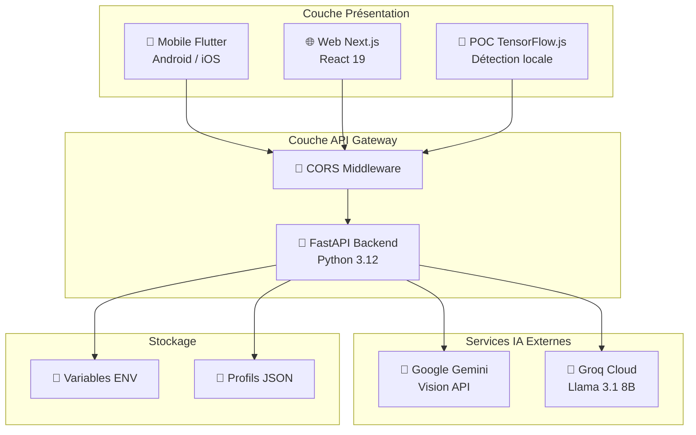
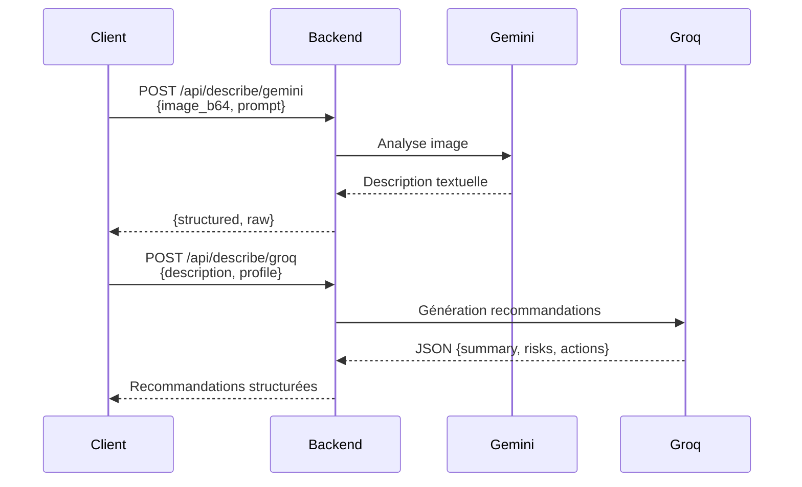
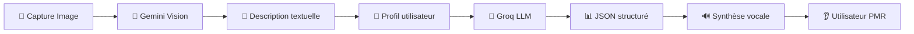

# 🏗️ Architecture Système - Vision360

## Vue d'ensemble

Vision360 est une architecture microservices composée de plusieurs applications clientes communiquant avec un backend API centralisé. Le système intègre deux services d'IA externes pour l'analyse d'images et la génération de recommandations.

## Diagramme d'architecture



## Composants principaux

### 1. Backend FastAPI (`/backend`)

Le cœur du système, exposant une API REST pour toutes les opérations.

#### Modules

| Fichier | Responsabilité |
|---------|----------------|
| `main.py` | Point d'entrée, configuration CORS, routage |
| `describe.py` | Intégration Gemini Vision et Groq LLM |
| `guidance.py` | Enrichissement des détections, analyse de risques |
| `reservations.py` | Gestion des réservations PMR (stub) |

#### Flux de traitement



### 2. Application Mobile Flutter (`/mobile_flutter`)

Application native cross-platform pour Android et iOS.

#### Architecture interne

```
lib/
└── main.dart
    ├── Vision360App          # Widget racine MaterialApp
    └── HomeScreen            # Écran principal stateful
        ├── Authentification  # Login/Register local
        ├── Profil utilisateur
        ├── Capture caméra
        ├── Appels API
        └── Synthèse vocale TTS
```

#### Fonctionnalités clés

- **Persistance locale** : SharedPreferences pour profils et historique
- **Caméra** : Capture et encodage base64
- **TTS** : flutter_tts pour lecture vocale des recommandations
- **Cooldown** : Protection contre les appels API excessifs (1 min)

### 3. Application Web Next.js (`/web_next`)

Interface web moderne avec React 19 et Next.js 16.

#### Architecture

```
src/app/
├── layout.tsx    # Layout racine, fonts, metadata
├── page.tsx      # Page principale avec logique
├── globals.css   # Styles globaux
└── page.module.css
```

#### Fonctionnalités

- **Webcam** : API MediaDevices pour capture
- **Speech Recognition** : API Web Speech pour commandes vocales
- **État local** : Hooks React (useState, useRef, useMemo)

### 4. POC Détection Temps Réel (`/poc-web`)

Prototype utilisant TensorFlow.js pour la détection d'objets côté client.

#### Stack technique

- **TensorFlow.js** : Inférence ML dans le navigateur
- **COCO-SSD** : Modèle pré-entraîné (80 classes)
- **WebGL/WebGPU** : Accélération GPU

#### Ontologie

Le fichier `ontology.json` définit les catégories de détection :

| Profil | Classes |
|--------|---------|
| `obstacles` | person, stairs, curb, door, cone, barrier, puddle |
| `retail` | product, shelf, price_tag, bottle, cart |
| `restaurant` | table, chair, tray, cutlery, terminal |
| `general` | 30+ classes COCO étendues |

## Flux de données

### Pipeline complet d'assistance



### Format des données

#### Requête Gemini
```json
{
  "image_b64": "data:image/jpeg;base64,...",
  "prompt": "Décris les objets visibles..."
}
```

#### Requête Groq
```json
{
  "description": "Sur l'image on voit...",
  "profile": "default",
  "profile_override": {
    "name": "Jean",
    "allergies": ["arachide"],
    "mobility": "fauteuil"
  }
}
```

#### Réponse Groq
```json
{
  "summary": "Environnement supermarché, rayon snacks",
  "risks": ["Produit contient arachide (allergie)"],
  "actions": ["Éviter ce produit", "Chercher alternative"]
}
```

## Schéma des endpoints API

| Méthode | Endpoint | Description |
|---------|----------|-------------|
| `GET` | `/health` | Vérification état du service |
| `POST` | `/api/describe/gemini` | Analyse d'image via Gemini |
| `POST` | `/api/describe/groq` | Génération recommandations |
| `POST` | `/api/guidance/enrich` | Enrichissement détection |
| `POST` | `/api/guidance/enrich/batch` | Enrichissement par lot |
| `POST` | `/api/guidance/advise` | Conseil personnalisé |
| `POST` | `/api/reservations` | Créer réservation PMR |
| `GET` | `/api/reservations` | Lister réservations |
| `GET` | `/api/reservations/{id}` | Détail réservation |

## Sécurité

### Gestion des clés API

- Stockage dans variables d'environnement (`.env`)
- Jamais exposées côté client
- Le backend sert de proxy sécurisé vers Gemini/Groq

### CORS

Configuration permissive en développement :
```python
allow_origins=["*"]
allow_methods=["*"]
allow_headers=["*"]
```

> ⚠️ À restreindre en production selon les domaines autorisés.

## Performances

### Optimisations implémentées

| Composant | Optimisation |
|-----------|-------------|
| POC Web | Stride (inférence 1 frame sur N) |
| Mobile | Cooldown 60s entre appels API |
| Backend | Client HTTP asynchrone (httpx) |
| TensorFlow.js | Backend WebGPU/WebGL auto |

### Métriques cibles

- **Latence Gemini** : < 3s
- **Latence Groq** : < 2s
- **FPS détection locale** : 15-30 fps (selon device)

## Évolutions futures

1. **Modèle custom** : Remplacer COCO-SSD par YOLOv8 entraîné sur données PMR
2. **Profondeur** : Intégrer ARCore/LiDAR pour distances précises
3. **OCR** : Reconnaissance texte pour étiquettes/menus
4. **Haptique** : Retour vibratoire selon urgence
5. **Cache** : Redis pour profils et réponses fréquentes
