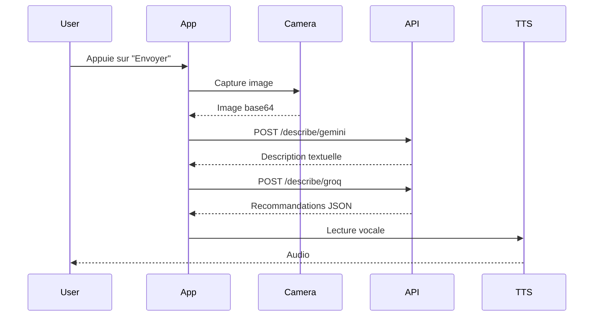

# 📱 Vision360 Mobile - Application Flutter

Application mobile cross-platform (Android/iOS) pour le système d'assistance Vision360 destiné aux personnes à mobilité réduite.

## Description

L'application Vision360 Mobile permet aux utilisateurs PMR de :

- **Capturer leur environnement** via la caméra du téléphone
- **Recevoir des descriptions** de la scène via l'IA Gemini
- **Obtenir des recommandations personnalisées** selon leur profil (allergies, mobilité)
- **Écouter les conseils** via synthèse vocale (TTS)
- **Consulter l'historique** des interactions

## Captures d'écran

| Connexion | Profil | Guidage | Historique |
|-----------|--------|---------|------------|
| Écran de connexion/inscription | Configuration du profil santé | Capture et recommandations | Liste des interactions |

## Fonctionnalités

### Authentification
- Connexion/Inscription (mock local avec SharedPreferences)
- Session persistante entre les lancements
- Profil par utilisateur

### Profil utilisateur
- Nom
- Allergies (liste séparée par virgules)
- Conditions médicales (diabète, etc.)
- Préférences alimentaires
- Type de mobilité (fauteuil, canne, marche)
- Activation/désactivation TTS

### Guidage
- Prévisualisation caméra en temps réel
- Capture d'image
- Envoi à l'API (Gemini → Groq)
- Affichage des recommandations JSON
- Lecture vocale (TTS)
- Mode debug pour voir les réponses brutes

### Historique
- Liste des interactions avec timestamps
- Export JSON vers fichier
- Copie dans le presse-papiers
- Suppression

## Installation

### Prérequis

- [Flutter SDK](https://flutter.dev/docs/get-started/install) 3.6+
- Android Studio ou Xcode
- Device physique ou émulateur avec caméra

### Étapes

```bash
# 1. Cloner le projet
git clone https://github.com/votre-repo/SAE-VISION360.git
cd SAE-VISION360/mobile_flutter

# 2. Installer les dépendances
flutter pub get

# 3. Vérifier l'installation
flutter doctor

# 4. Lancer sur un device
flutter run
```

### Build release

```bash
# Android APK
flutter build apk --release

# Android App Bundle (Play Store)
flutter build appbundle --release

# iOS (macOS uniquement)
flutter build ios --release
```

## Configuration

### URL de l'API

Par défaut, l'application pointe vers l'API Cloud Run :
```
https://vision360-backend-276274707876.europe-west1.run.app/api
```

Pour utiliser un backend local :
1. Lancer le backend localement sur le port 8000
2. Dans l'onglet Profil, modifier l'URL :
   - Émulateur Android : `http://10.0.2.2:8000/api`
   - Simulateur iOS : `http://localhost:8000/api`
   - Device physique : `http://IP_DE_VOTRE_PC:8000/api`

### Permissions requises

#### Android (`android/app/src/main/AndroidManifest.xml`)
```xml
<uses-permission android:name="android.permission.CAMERA" />
<uses-permission android:name="android.permission.INTERNET" />
<uses-permission android:name="android.permission.RECORD_AUDIO" />
```

#### iOS (`ios/Runner/Info.plist`)
```xml
<key>NSCameraUsageDescription</key>
<string>Vision360 utilise la caméra pour analyser votre environnement</string>
<key>NSMicrophoneUsageDescription</key>
<string>Vision360 utilise le micro pour les commandes vocales</string>
```

## Architecture

```
lib/
└── main.dart
    ├── Vision360App          # Widget racine MaterialApp
    └── HomeScreen            # Écran principal StatefulWidget
        ├── _buildAuthScreen()     # Écran connexion/inscription
        ├── _buildProfileTab()     # Onglet configuration
        ├── _buildGuidanceTab()    # Onglet caméra/API
        └── _buildHistoryTab()     # Onglet historique
```

### Gestion d'état

L'application utilise `StatefulWidget` avec `SharedPreferences` pour :
- Stockage des credentials utilisateurs (mock)
- Persistance du profil utilisateur
- Sauvegarde de l'historique des interactions

### Flux de données



## Dépendances

| Package | Version | Usage |
|---------|---------|-------|
| `flutter` | SDK | Framework UI |
| `camera` | ^0.11.0+2 | Capture caméra |
| `flutter_tts` | ^4.2.3 | Synthèse vocale |
| `http` | ^1.3.0 | Appels HTTP |
| `shared_preferences` | ^2.3.3 | Stockage local |
| `path_provider` | ^2.1.5 | Accès fichiers |
| `cupertino_icons` | ^1.0.8 | Icônes iOS |

## Tests

```bash
# Tests unitaires
flutter test

# Tests avec couverture
flutter test --coverage
```

## Dépannage

### "Camera not available"
- Vérifier les permissions dans les paramètres du device
- Utiliser un émulateur avec caméra virtuelle configurée

### Erreur réseau
- Vérifier que le backend est accessible
- Sur émulateur Android, utiliser `10.0.2.2` au lieu de `localhost`

### TTS ne fonctionne pas
- Vérifier que le switch TTS est activé dans le profil
- Certains émulateurs n'ont pas de moteur TTS

## Évolutions futures

- [ ] Intégration reconnaissance vocale native
- [ ] Mode hors-ligne avec modèle embarqué
- [ ] Support multi-langues
- [ ] Retour haptique pour alertes
- [ ] Widget d'accessibilité
