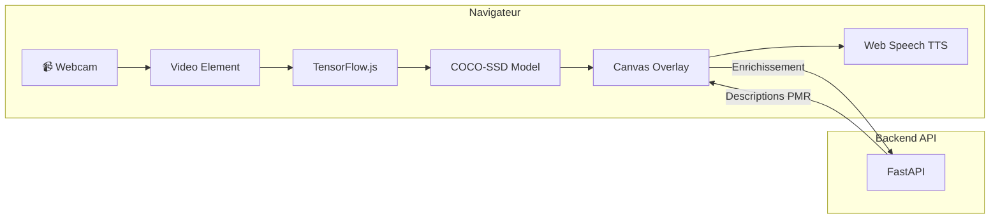

# 🧪 POC Vision360 - Détection Temps Réel

Prototype de détection d'objets en temps réel utilisant TensorFlow.js et le modèle COCO-SSD directement dans le navigateur.

## Description

Ce POC (Proof of Concept) démontre la faisabilité d'une détection d'obstacles côté client sans serveur dédié pour l'inférence ML. Il permet de :

- **Détecter des objets** en temps réel via la webcam
- **Classifier selon des profils** (obstacles, retail, restaurant)
- **Enrichir les détections** via l'API backend
- **Générer des alertes vocales** (TTS)
- **Exporter des données** d'entraînement

## Architecture



## Prérequis

- Navigateur moderne (Chrome/Edge recommandé pour WebGPU)
- Webcam fonctionnelle
- Connexion internet (pour charger TensorFlow.js)

## Lancement

```bash
# Option 1 : Python
cd poc-web
python -m http.server 8080

# Option 2 : Node.js
npx serve .

# Option 3 : PHP
php -S localhost:8080
```

Ouvrir http://localhost:8080 et autoriser l'accès à la caméra.

## Interface

### Barre d'outils

| Contrôle | Description |
|----------|-------------|
| **Start/Stop** | Démarrer/arrêter la détection |
| **TTS** | Activer/désactiver les alertes vocales |
| **Vision profile** | Profil de détection (general, obstacles, retail, restaurant) |
| **User profile** | Profil utilisateur PMR |
| **Conf** | Seuil de confiance (0-1) |
| **MinArea** | Aire minimale des détections (fraction de l'image) |
| **Backend** | Backend TensorFlow (auto/webgpu/webgl/cpu) |
| **Gemini** | Appeler l'API Gemini pour description |
| **Groq** | Appeler l'API Groq pour recommandations |

### Zones d'affichage

- **Canvas** : Flux vidéo avec boîtes de détection
- **Labels** : Liste des objets détectés
- **Guidance** : Résultat des appels API
- **Stats** : FPS, latence, nombre d'objets, backend actif

## Fonctionnement

### Pipeline de détection

1. **Capture frame** : La vidéo est dessinée sur le canvas
2. **Inférence COCO-SSD** : Le modèle détecte jusqu'à 20 objets
3. **Filtrage** : Par confiance, aire minimale et classes autorisées
4. **Enrichissement** : Zone (near/mid/far) et côté (left/center/right)
5. **Affichage** : Boîtes et labels sur le canvas
6. **TTS** : Alertes vocales si activé

### Calcul des zones

| Zone | Condition |
|------|-----------|
| `near` | Aire > 8% de l'image |
| `mid` | Aire entre 3% et 8% |
| `far` | Aire < 3% |

### Calcul des côtés

| Côté | Condition |
|------|-----------|
| `left` | Centre X < 33% de la largeur |
| `center` | Centre X entre 33% et 66% |
| `right` | Centre X > 66% |

## Ontologie

Le fichier `ontology.json` définit les profils de détection :

### obstacles
Classes pour la navigation urbaine :
- person, crowd, stairs, curb, door, cone, barrier, puddle

### retail
Classes pour le supermarché :
- product, shelf, price_tag, barcode, cart, bottle, can, produce

### restaurant
Classes pour la restauration :
- table, chair, tray, cutlery, plate, glass, menu, terminal

### general
Classes COCO étendues (30+ objets courants)

### Synonymes

Chaque classe peut avoir des synonymes pour améliorer le matching :
```json
{
  "person": ["people", "human", "personne"],
  "stairs": ["stair", "staircase", "escalier"]
}
```

## Intégration API

### Bouton Gemini

Capture le canvas et envoie à `/api/describe/gemini` pour obtenir une description textuelle de la scène.

### Bouton Groq

Prend la dernière description Gemini et l'envoie à `/api/describe/groq` avec le profil utilisateur sélectionné pour obtenir des recommandations personnalisées.

## Performances

| Backend | FPS typique | Latence |
|---------|-------------|---------|
| WebGPU | 25-30 | 30-40ms |
| WebGL | 15-25 | 40-60ms |
| CPU | 5-10 | 100-200ms |

### Optimisations

- **Stride** : Inférence 1 frame sur N (réduit CPU/GPU)
- **Résolution** : Entrée 480p par défaut
- **Modèle** : lite_mobilenet_v2 (léger et rapide)

## Export de données

Le POC permet d'exporter des données pour entraîner un modèle custom :

- **Snapshot** : Capture PNG de la frame
- **Capture Sample** : PNG + JSON des détections
- **Download CSV** : Métriques (timestamp, FPS, latence, objets)

## Fichiers

```
poc-web/
├── index.html        # Application complète (HTML + JS inline)
├── ontology.json     # Définition des profils et synonymes
├── vendor/           # (optionnel) TF.js et COCO-SSD en local
│   ├── tf.min.js
│   └── coco-ssd.min.js
├── fetch_vendor.sh   # Script pour télécharger les vendors
└── README.md
```

## Limites

- **Modèle générique** : COCO-SSD détecte 80 classes génériques, pas spécifiques PMR
- **Pas de profondeur** : Les zones sont estimées par la taille, pas par capteur
- **TTS simplifié** : Phrases basiques sans contextualisation avancée
- **Pas d'OCR** : Lecture des étiquettes non implémentée

## Évolutions futures

- [ ] Modèle YOLO custom entraîné sur obstacles PMR
- [ ] Intégration ARCore/LiDAR pour distances réelles
- [ ] OCR pour lecture d'étiquettes et menus
- [ ] Mode offline avec modèle embarqué
- [ ] PWA pour installation sur mobile
