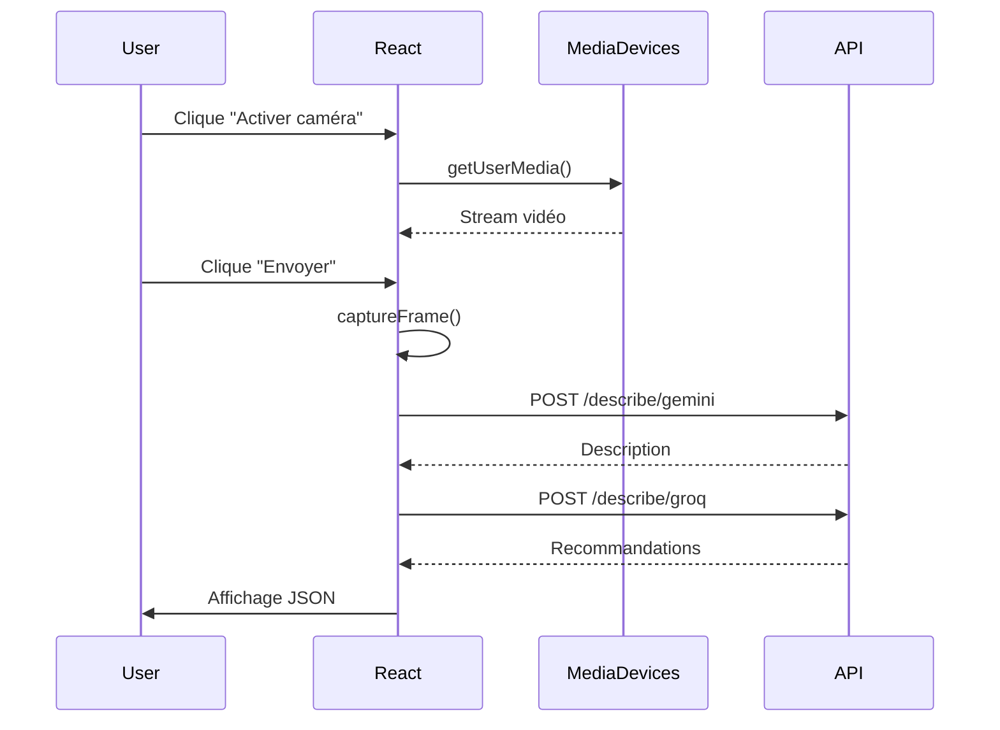

# 🌐 Vision360 Web - Application Next.js

Application web moderne pour le système d'assistance Vision360, construite avec Next.js 16 et React 19.

## Description

L'application Vision360 Web offre une interface navigateur complète pour :

- **Configurer un profil santé** (allergies, conditions, mobilité)
- **Capturer des images** via la webcam du navigateur
- **Analyser l'environnement** avec l'IA Gemini
- **Recevoir des recommandations** personnalisées via Groq
- **Utiliser la reconnaissance vocale** pour les commandes
- **Consulter l'historique** des interactions

## Fonctionnalités

### Profil santé
- Nom utilisateur
- Allergies (liste)
- Conditions médicales
- Préférences alimentaires
- Type de mobilité (fauteuil, canne, marche)
- Activation TTS

### Capture d'image
- Accès webcam via API MediaDevices
- Capture de frame en JPEG
- Prévisualisation en temps réel
- Support caméra arrière (mobile)

### Analyse IA
- Envoi à Gemini pour description textuelle
- Envoi à Groq pour recommandations JSON
- Mode debug avec réponses brutes
- Cooldown de 60s entre requêtes

### Commandes vocales
- API Web Speech Recognition
- Support français (fr-FR)
- Transcription en temps réel

## Installation

### Prérequis

- [Node.js](https://nodejs.org) 20+
- npm, yarn, pnpm ou bun

### Développement

```bash
# 1. Aller dans le dossier
cd web_next

# 2. Installer les dépendances
npm install

# 3. Configurer l'environnement (optionnel)
echo "NEXT_PUBLIC_API_BASE=http://localhost:8000/api" > .env.local

# 4. Lancer le serveur de développement
npm run dev
```

Accéder à http://localhost:3000

### Production

```bash
# Build
npm run build

# Démarrer
npm run start
```

## Configuration

### Variables d'environnement

| Variable | Description | Défaut |
|----------|-------------|--------|
| `NEXT_PUBLIC_API_BASE` | URL de l'API Vision360 | `https://vision360-backend-...run.app/api` |

### Fichier `.env.local`

```env
# Backend local
NEXT_PUBLIC_API_BASE=http://localhost:8000/api

# Backend Cloud Run (production)
# NEXT_PUBLIC_API_BASE=https://vision360-backend-276274707876.europe-west1.run.app/api
```

## Architecture

```
web_next/
├── src/
│   └── app/
│       ├── layout.tsx      # Layout racine, polices, metadata
│       ├── page.tsx        # Page principale avec toute la logique
│       ├── globals.css     # Styles globaux
│       └── page.module.css # Styles de la page
├── public/                 # Assets statiques
├── package.json
├── Dockerfile
└── README.md
```

### Composants

L'application utilise un seul composant principal `Home` avec :

- **État local** : React hooks (useState, useRef, useMemo)
- **Références DOM** : video et canvas pour la webcam
- **Effets** : Nettoyage de la caméra au démontage

### Flux de données



## Scripts npm

| Script | Description |
|--------|-------------|
| `npm run dev` | Serveur de développement avec hot reload |
| `npm run build` | Build de production |
| `npm run start` | Démarrer en mode production |
| `npm run lint` | Vérification ESLint |

## Déploiement

### Vercel (Recommandé)

```bash
# Installer Vercel CLI
npm i -g vercel

# Déployer
vercel

# Configurer la variable d'environnement
vercel env add NEXT_PUBLIC_API_BASE
```

### Docker

```bash
# Build l'image
docker build -t vision360-web .

# Lancer le conteneur
docker run -p 3000:3000 -e NEXT_PUBLIC_API_BASE=http://localhost:8000/api vision360-web
```

### Google Cloud Run

Voir [docs/DEPLOYMENT.md](../docs/DEPLOYMENT.md).

## Dépendances

| Package | Version | Usage |
|---------|---------|-------|
| `next` | 16.1.6 | Framework React full-stack |
| `react` | 19.2.3 | Bibliothèque UI |
| `react-dom` | 19.2.3 | Rendu DOM |
| `typescript` | ^5 | Typage statique |
| `eslint` | ^9 | Linting |

## Compatibilité navigateur

| Fonctionnalité | Chrome | Firefox | Safari | Edge |
|----------------|--------|---------|--------|------|
| Webcam | ✅ | ✅ | ✅ | ✅ |
| Web Speech | ✅ | ⚠️ | ⚠️ | ✅ |
| TTS | ✅ | ✅ | ✅ | ✅ |

⚠️ = Support partiel ou nécessite des flags

## Dépannage

### Webcam non accessible
- Vérifier les permissions du navigateur
- HTTPS requis en production (localhost OK en dev)
- Tester avec `navigator.mediaDevices.getUserMedia({video: true})`

### Reconnaissance vocale non disponible
- Chrome/Edge recommandés
- Vérifier l'accès au microphone
- L'API n'est pas disponible en navigation privée sur certains navigateurs

### Erreurs CORS
- Vérifier que le backend est accessible
- Le backend doit autoriser l'origine du frontend
